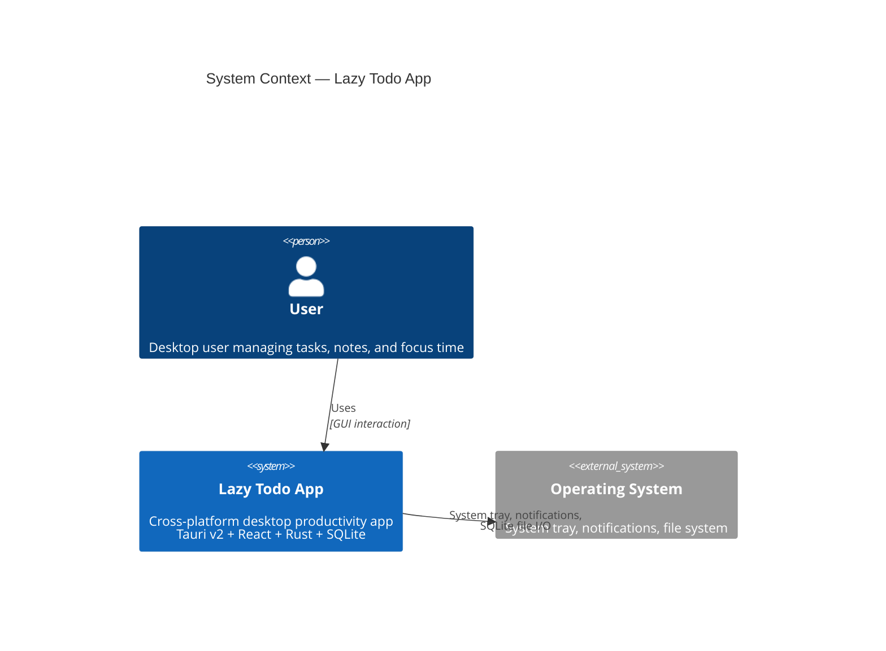
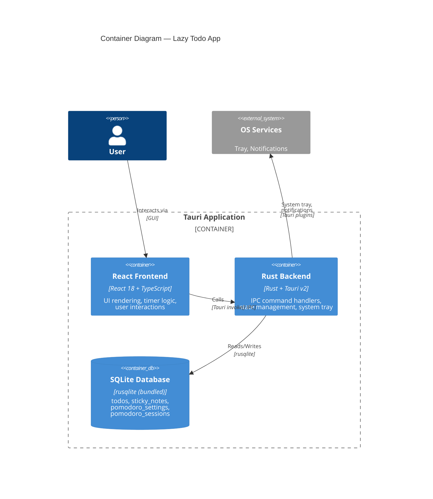
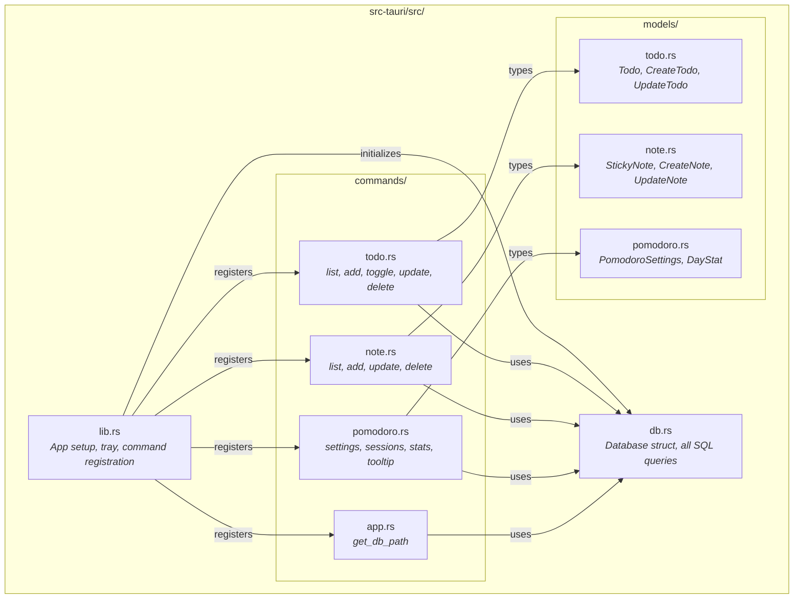
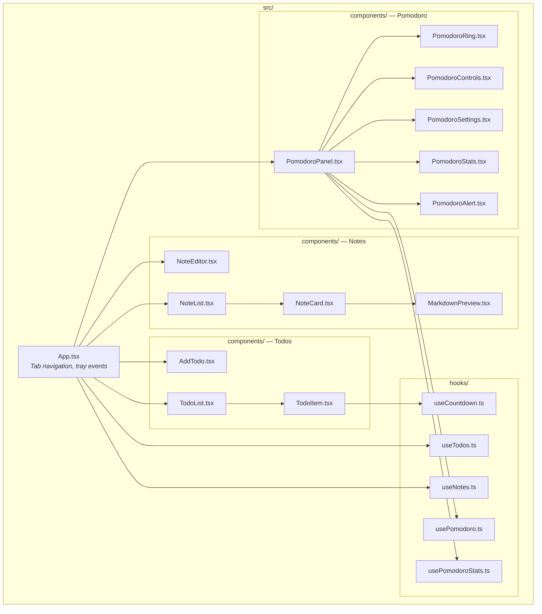
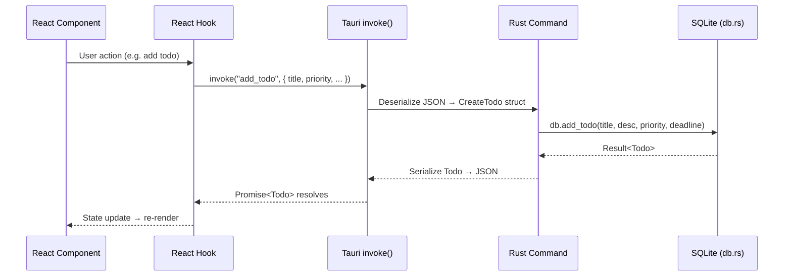

# Lazy Todo App — Architecture

<!-- maintained-by: human+ai -->

## C4 Model

### Level 1: System Context

The Lazy Todo App is a standalone desktop application. It has no external service dependencies — all data is stored locally. The only external interactions are OS-level: system tray, native notifications, and file system (SQLite).



### Level 2: Container

The application consists of two runtime containers packaged into a single binary:



**Communication pattern**: The frontend NEVER accesses the file system or database directly. All data flows through Tauri's `invoke()` IPC mechanism, which serializes/deserializes JSON between the webview and Rust.

### Level 3: Component

#### Rust Backend Components



#### React Frontend Components



### Level 4: Code

#### Database Schema (SQLite)

```sql
-- Table: todos
CREATE TABLE IF NOT EXISTS todos (
    id          INTEGER PRIMARY KEY AUTOINCREMENT,
    title       TEXT NOT NULL,
    description TEXT NOT NULL DEFAULT '',
    priority    INTEGER NOT NULL DEFAULT 2,  -- 1=High, 2=Medium, 3=Low
    completed   INTEGER NOT NULL DEFAULT 0,
    deadline    TEXT,                         -- ISO 8601
    created_at  TEXT NOT NULL DEFAULT (datetime('now'))
);

-- Table: sticky_notes
CREATE TABLE IF NOT EXISTS sticky_notes (
    id          INTEGER PRIMARY KEY AUTOINCREMENT,
    title       TEXT NOT NULL DEFAULT '',
    content     TEXT NOT NULL DEFAULT '',
    color       TEXT NOT NULL DEFAULT 'yellow',
    created_at  TEXT NOT NULL DEFAULT (datetime('now')),
    updated_at  TEXT NOT NULL DEFAULT (datetime('now'))
);

-- Table: pomodoro_settings (singleton row, id=1)
CREATE TABLE IF NOT EXISTS pomodoro_settings (
    id               INTEGER PRIMARY KEY CHECK (id = 1),
    work_minutes     INTEGER NOT NULL DEFAULT 25,
    short_break_min  INTEGER NOT NULL DEFAULT 5,
    long_break_min   INTEGER NOT NULL DEFAULT 15,
    rounds_per_cycle INTEGER NOT NULL DEFAULT 4
);

-- Table: pomodoro_sessions
CREATE TABLE IF NOT EXISTS pomodoro_sessions (
    id           INTEGER PRIMARY KEY AUTOINCREMENT,
    completed_at TEXT NOT NULL DEFAULT (datetime('now')),
    duration_min INTEGER NOT NULL
);
```

#### IPC Data Flow (Sequence)



## Key Architectural Decisions

| Decision | Rationale |
|----------|-----------|
| Frontend timer via `setInterval` | Avoids Rust async complexity; Web Audio API available for alerts |
| CSS visibility toggle (not conditional render) for Pomodoro tab | Prevents timer reset when switching tabs |
| Single `db.rs` file for all queries | Project is small enough; avoids over-abstraction |
| `rusqlite` with `bundled` feature | No external SQLite dependency needed at runtime |
| System tray via Tauri API | Native integration; close-to-tray pattern |
| Web Audio API for alert chime | No external audio files needed; works cross-platform |
| `LAZY_TODO_DB_DIR` env var for DB path | Simple override without config file complexity |

---
<!-- PKB-metadata
last_updated: 2026-04-07
commit: 4c09050
updated_by: human+ai
-->
