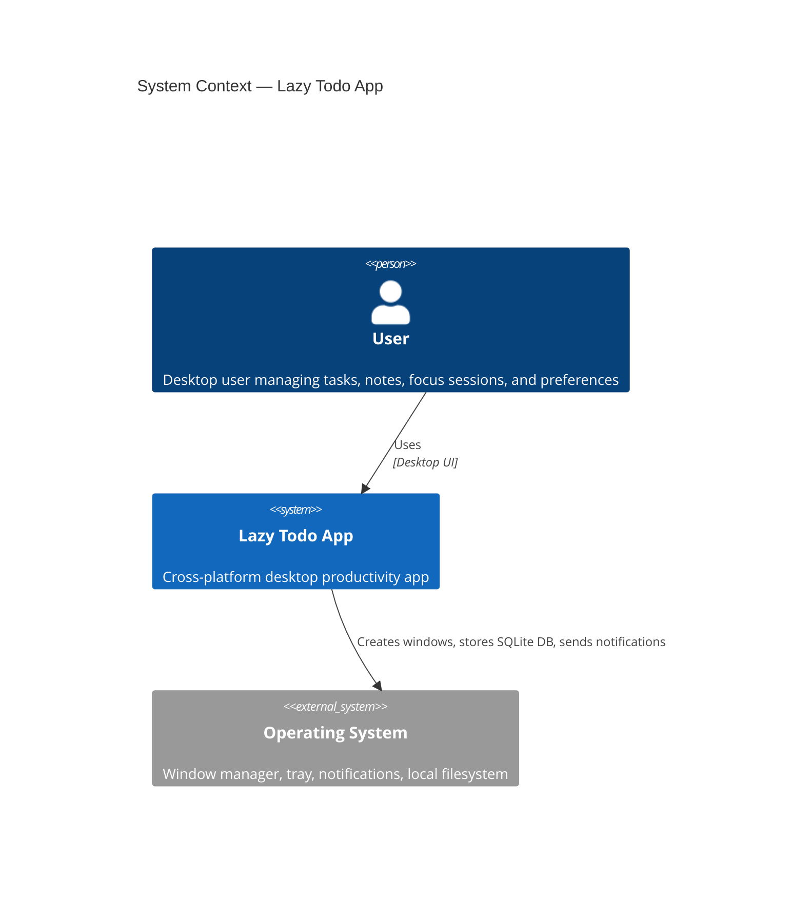
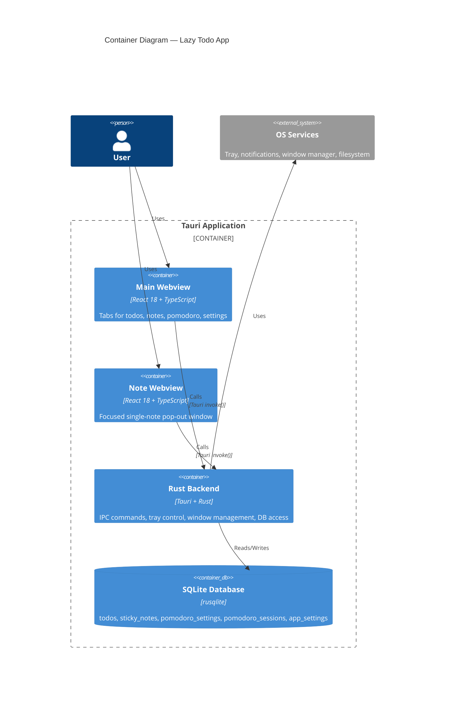
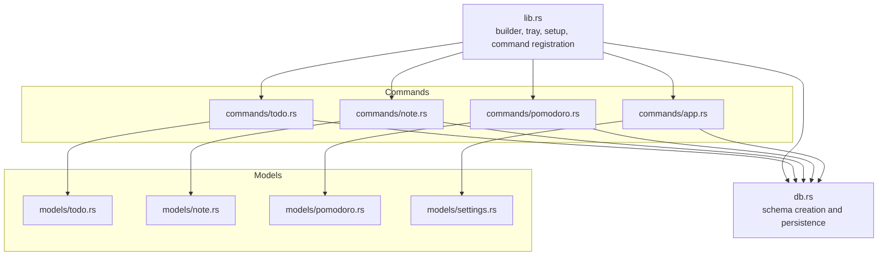
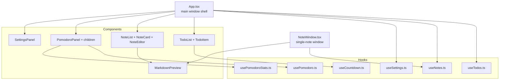
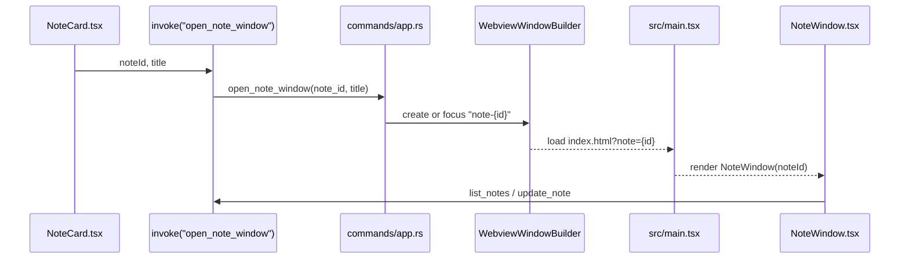

# Lazy Todo App — Architecture

<!-- maintained-by: human+ai -->

## C4 Model

### Level 1: System Context

Lazy Todo App is a local-first desktop productivity system. It does not depend on any hosted backend. Its only external integrations are operating-system capabilities such as windows, tray menus, notifications, and local file storage.

### Level 2: Container

The app is packaged as a single desktop binary but runs with multiple cooperating runtime containers inside the Tauri shell.

**Boundary rule**: the frontend never talks directly to SQLite or the filesystem. Every state mutation crosses the `invoke()` boundary into Rust first.

### Level 3: Component

#### Rust Backend Components

#### React Frontend Components

### Level 4: Code

#### Persistence Model

The SQLite schema currently uses five tables:

- `todos`
- `sticky_notes`
- `pomodoro_settings`
- `pomodoro_sessions`
- `app_settings`

Two singleton-style tables hold configuration:

- `pomodoro_settings` stores timer lengths plus `milestones_json`
- `app_settings` stores display preferences, note defaults, and storage-related UI hints

#### Representative Flow: Open a Sticky Note in Its Own Window

## Key Architectural Decisions

| Decision | Rationale |
|----------|-----------|
| Keep all persistence in `db.rs` | Centralizes schema and SQL in one place for a small app |
| Persist app settings in SQLite | Settings survive restarts and reuse the same backend contract pattern as other features |
| Use a separate note window webview | Gives sticky notes a desktop-native feel without introducing a second frontend bundle |
| Hide the pomodoro tab instead of unmounting it | Prevents timer state from resetting when the user changes tabs |
| Store pomodoro milestones as JSON in `pomodoro_settings` | Keeps milestone data attached to the singleton timer config without another relational table |
| Resolve DB location from env, then config file, then app data | Supports both ad hoc overrides and persistent local configuration |
| Open external links with the shell plugin | Avoids in-webview navigation and keeps Markdown note links safe and predictable |

---
<!-- PKB-metadata
last_updated: 2026-04-12
commit: f9ba186
updated_by: human+ai
-->
