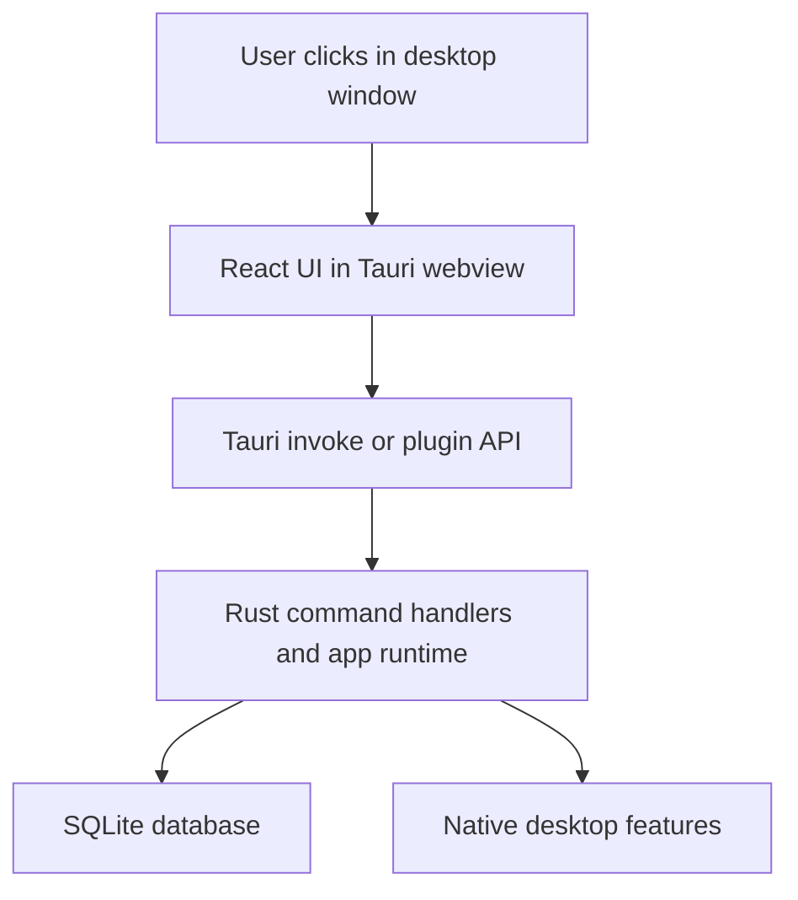

# Lazy Todo App — Tech Stack

<!-- maintained-by: human+ai -->

## Purpose

This page explains the main technologies used in `lazy-todo-app` and, more importantly, how they work together at runtime.

If you are new to this stack, the key idea is:

- React renders the user interface inside a desktop webview
- Tauri wraps that webview as a native desktop app and provides the bridge to Rust
- Rust handles desktop capabilities, command execution, and SQLite persistence

## System View

## Stack Summary

| Layer | Main Technology | Why It Exists In This Repo |
|---|---|---|
| Desktop shell | Tauri v2 | Turns the app into a native desktop program with windows, tray, notifications, and packaging |
| Frontend UI | React 18 + TypeScript | Builds the todo, note, pomodoro, and settings interfaces |
| Frontend build tool | Vite | Provides fast local development and bundles the web assets for Tauri |
| Backend runtime | Rust | Implements Tauri commands, database access, tray logic, and window lifecycle |
| Local storage | SQLite via `rusqlite` | Persists todos, sticky notes, pomodoro state, and app settings |
| Markdown rendering | `react-markdown` + `remark-gfm` | Renders note content with GitHub Flavored Markdown support |
| Native integrations | Tauri plugins | Opens external links and shows native notifications |

## React + TypeScript Frontend

### What React Is Doing Here

React is the UI layer. It is responsible for rendering the screens and responding to user interactions such as:

- adding or completing todos
- editing sticky notes
- switching pomodoro phases
- opening the settings panel

The frontend code lives in `src/`.

Important frontend files:

- `src/main.tsx`: bootstraps the UI and decides whether to render the main app or a dedicated note window
- `src/App.tsx`: main application shell
- `src/components/`: reusable UI pieces such as todo lists, note cards, and pomodoro panels
- `src/components/toolbox/`: the Toolbox tab — a fully client-side suite of utility tools (conversion, checksum, generation, encryption) built on the Web Crypto API
- `src/hooks/`: logic reuse for countdowns, pomodoro state, settings, and data access
- `src/utils/`: shared frontend utilities; `crypto.ts` powers the Toolbox with Web Crypto helpers and a built-in MD5
- `src/types/`: shared TypeScript types used by the frontend

### Why TypeScript Matters

TypeScript adds static types on top of JavaScript. In this repo, that is useful because the frontend sends structured data to Rust commands and expects structured responses back.

That helps with:

- catching incorrect field names at development time
- making component props easier to understand
- keeping frontend models aligned with backend data shapes

### Frontend Libraries In Use

| Package | Role In This Repo |
|---|---|
| `react` | Component rendering and state-driven UI updates |
| `react-dom` | Mounts the React app into the Tauri webview DOM |
| `@tauri-apps/api` | Lets the frontend call backend Tauri commands |
| `@tauri-apps/plugin-shell` | Opens external HTTP links in the system browser |
| `@tauri-apps/plugin-notification` | Supports native desktop notifications from the app |
| `react-markdown` | Converts Markdown note text into rendered HTML |
| `remark-gfm` | Adds GitHub Flavored Markdown features such as tables and task list formatting |

### How React Fits This App

Think of React as the "screen logic" layer:

- it reads current app state
- it renders the visible UI from that state
- it calls Tauri when the UI needs native or persistent behavior

React does **not** directly talk to SQLite or native desktop APIs. Those responsibilities stay behind the Tauri bridge.

## Tauri Desktop Layer

### What Tauri Is

Tauri is the desktop application framework that combines:

- a web frontend, rendered inside a native webview
- a Rust backend, running as the native host application

That means you can use familiar web UI tools like React and CSS while still shipping a desktop app for macOS, Linux, and Windows.

### What Tauri Does In This Repo

In `lazy-todo-app`, Tauri is responsible for:

- creating and running the desktop application
- managing the main window and note pop-out windows
- exposing backend commands to the frontend through `invoke()`
- handling system tray behavior
- packaging the app into desktop installers

The main Tauri setup lives in `src-tauri/src/lib.rs`.

Concrete examples from this repo:

- the app registers command handlers with `tauri::generate_handler!`
- the database is created once and stored as managed state with `app.manage(database)`
- the tray menu is created in Rust and can show, hide, or quit the app
- closing the main window hides it instead of fully exiting the app

### Why Tauri Is Helpful Here

For this project, Tauri gives a clean split:

- React focuses on UI and interaction
- Rust focuses on local persistence and desktop-native behavior

This is a good fit for an offline-first productivity tool that needs windows, tray integration, notifications, and local files without introducing a remote backend service.

## Rust Backend

### What Rust Is Doing Here

Rust is the backend language used by the Tauri host application.

In this repo, Rust handles:

- command handlers that the frontend invokes
- SQLite persistence
- tray setup and window lifecycle
- platform-aware path resolution for the local database

### Main Rust Areas

| Path | Responsibility |
|---|---|
| `src-tauri/src/lib.rs` | Tauri app startup, plugin registration, tray setup, command registration |
| `src-tauri/src/commands/` | Tauri command handlers for todos, notes, pomodoro, and app actions |
| `src-tauri/src/db.rs` | SQLite setup and persistence operations |
| `src-tauri/src/models/` | Rust data models for app entities |

### Why Rust Helps

Rust is a strong fit for the desktop/backend side because it gives:

- good performance for a native desktop host
- strong compile-time checks
- safe memory management without a garbage collector
- a clean way to represent typed command inputs and outputs

For a beginner, the most important concept is not low-level memory management. The useful takeaway is that Rust helps make the command layer and persistence layer more reliable.

### Key Rust Dependencies In This Repo

| Crate | Role In This Repo |
|---|---|
| `tauri` | Desktop runtime, command bridge, window and tray APIs |
| `tauri-build` | Build-time support for packaging the Tauri app |
| `tauri-plugin-shell` | Shell and external-link integration |
| `tauri-plugin-notification` | Native desktop notifications |
| `serde` | Serialization and deserialization of structured data |
| `serde_json` | JSON parsing for config and payload handling |
| `rusqlite` | SQLite access from Rust |
| `chrono` | Date and time handling for todos and pomodoro data |
| `dirs` | Cross-platform lookup of user and app data directories |

## Data Flow: React -> Tauri -> Rust -> SQLite

When a user performs an action such as creating a todo, the request path is:

1. A React component handles the click or form submission.
2. The frontend calls a Tauri command through `invoke()`.
3. Rust receives that command in `src-tauri/src/commands/`.
4. The Rust command uses the shared `Database` state.
5. `rusqlite` reads or writes data in SQLite.
6. Rust returns a structured result back to the frontend.
7. React updates the UI with the new state.

This separation is important because it keeps persistence and desktop capabilities out of the browser-like frontend layer.

## Build And Packaging Toolchain

### Frontend Build

The frontend uses Vite and TypeScript:

- `npm run dev` starts the Vite development server
- `npm run build` runs TypeScript checks and bundles frontend assets

### Desktop Build

The desktop app is built with Tauri:

- `npm run tauri dev` runs the desktop app in development mode
- `npm run tauri build` packages the app for the current platform

Generated installers are created under `src-tauri/target/release/bundle/`.

### Release Automation

The repo also includes GitHub Actions workflows for:

- desktop release builds on version tags
- documentation publishing to GitHub Pages
- advisory PKB freshness checks for docs maintenance

See `08-build.md` for the release and publishing workflow in detail.

## What To Learn First

If this stack is new to you, learn it in this order:

1. Read `src/main.tsx` and `src/App.tsx` to see how the UI starts.
2. Read `src-tauri/src/lib.rs` to understand how Tauri boots the native app.
3. Read one command file under `src-tauri/src/commands/` to see how frontend-to-backend calls work.
4. Read `src-tauri/src/db.rs` to understand local persistence.
5. Run `npm run tauri dev` and watch how a UI action travels through the stack.

That order usually makes the architecture easier to understand than learning React, Rust, and Tauri in isolation.

## Common Misconceptions

| Misconception | Reality In This Repo |
|---|---|
| "React is the whole app." | React is only the UI layer. Native behavior and persistence live in Rust through Tauri. |
| "Tauri replaces React." | Tauri does not replace React. It wraps the React app as a desktop application and bridges it to native code. |
| "Rust is only for performance." | Here Rust is mainly valuable for reliability, desktop integration, and typed command handling. |
| "The frontend can talk directly to SQLite." | It cannot. The frontend goes through Tauri commands, and Rust owns database access. |

---
<!-- PKB-metadata
last_updated: 2026-04-12
commit: 628f0c1
updated_by: human+ai
-->
