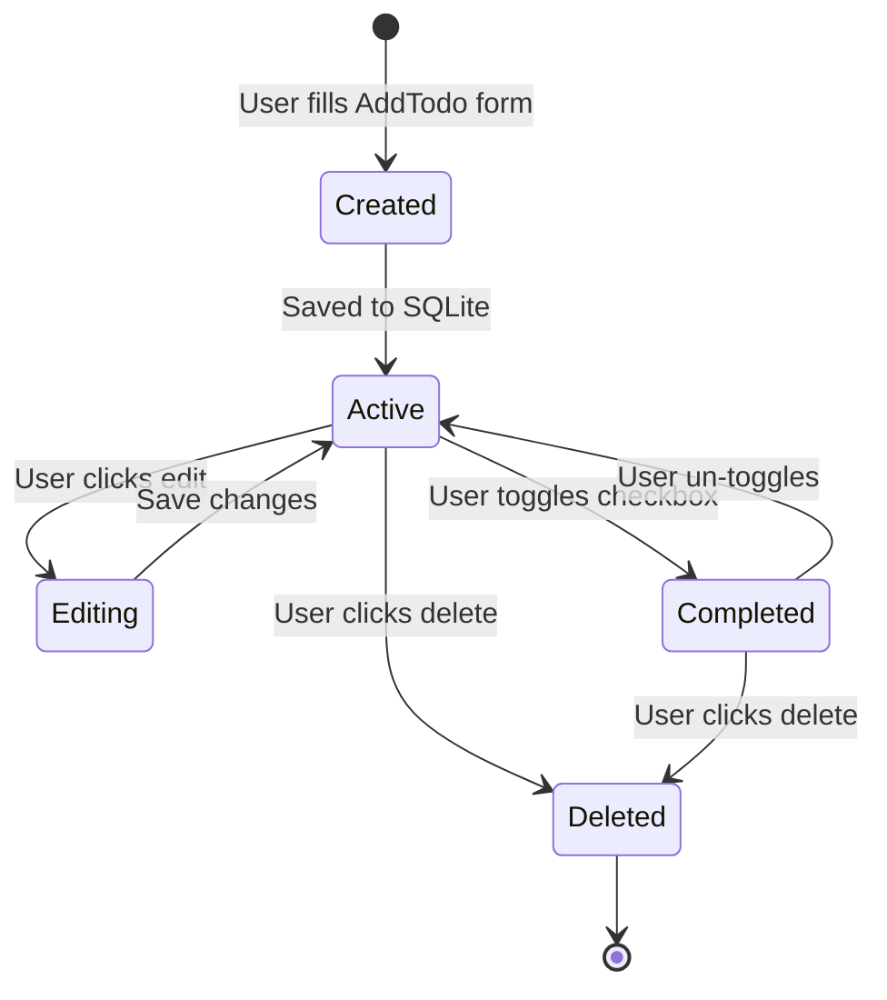
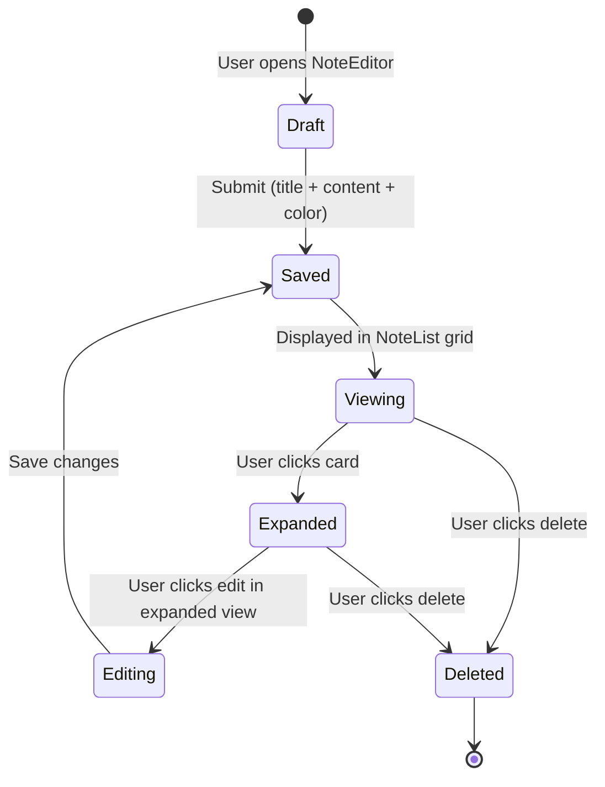
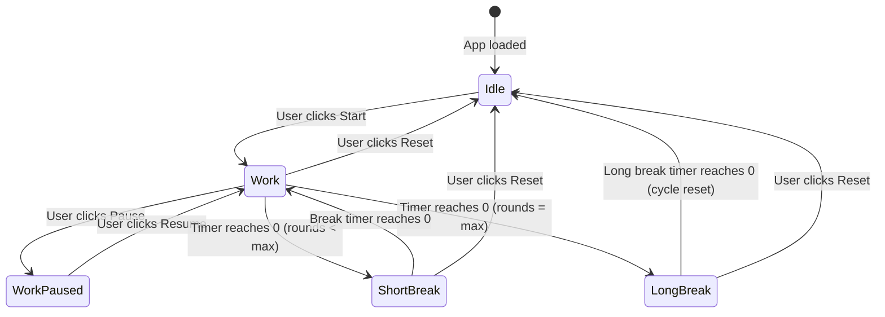
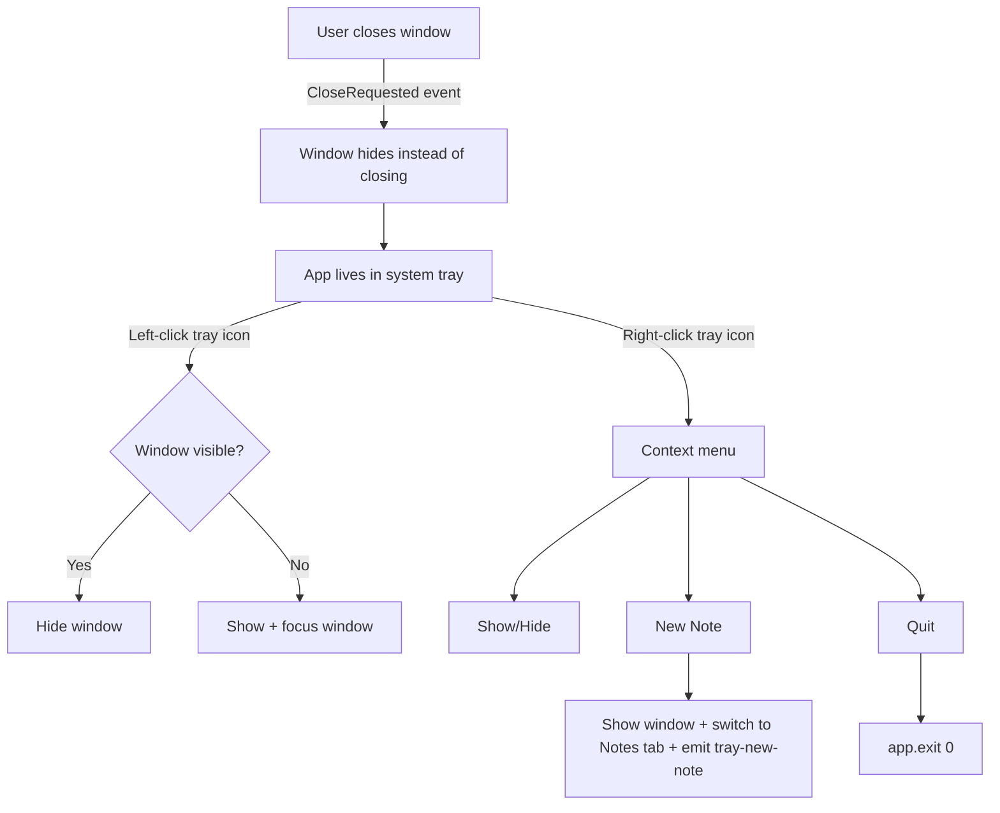
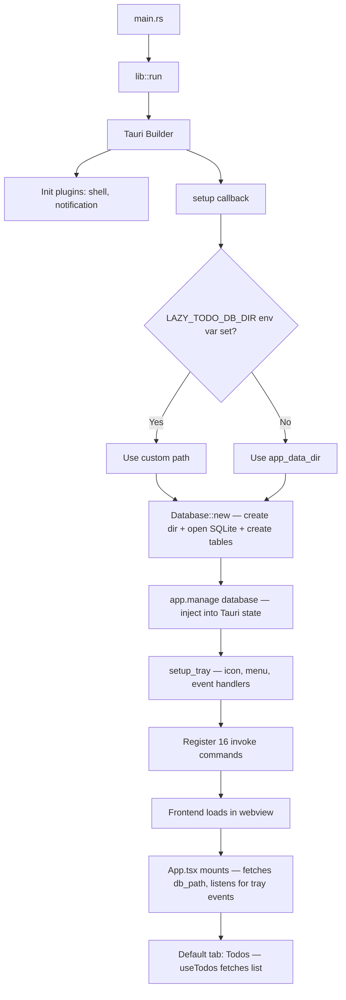

# Lazy Todo App — Workflows

<!-- maintained-by: human+ai -->

## Workflow 1: Todo Lifecycle

A todo item flows through creation, optional editing, completion, and deletion.

### Code Path

1. **Create**: `AddTodo.tsx` → `useTodos.addTodo()` → `invoke("add_todo", CreateTodo)` → `commands/todo.rs::add_todo` → `db.rs::add_todo`
2. **List**: On mount, `useTodos` calls `invoke("list_todos")` → `db.rs::list_todos` (ordered by `completed ASC, priority ASC, deadline ASC NULLS LAST`)
3. **Toggle**: `TodoItem.tsx` checkbox → `useTodos.toggleTodo(id)` → `invoke("toggle_todo")` → `db.rs::toggle_todo` (flips `completed` column)
4. **Edit**: `TodoItem.tsx` inline fields → `useTodos.updateTodo(UpdateTodo)` → `invoke("update_todo")` → `db.rs::update_todo` (partial update)
5. **Delete**: `TodoItem.tsx` delete button → `useTodos.deleteTodo(id)` → `invoke("delete_todo")` → `db.rs::delete_todo`

### Countdown Timer

`useCountdown.ts` runs a `setInterval(1000ms)` that recalculates remaining time for each todo with a `deadline`. Visual states:
- **Normal**: white text
- **< 1 hour**: orange text
- **Overdue**: red text

## Workflow 2: Sticky Note Lifecycle

### Code Path

1. **Create**: `NoteEditor.tsx` → `useNotes.addNote(CreateNote)` → `invoke("add_note")` → `db.rs::insert_note`
2. **List**: `useNotes` calls `invoke("list_notes")` → `db.rs::list_notes` (ordered by `updated_at DESC`)
3. **Edit**: `NoteCard.tsx` inline editing → `useNotes.updateNote(UpdateNote)` → `invoke("update_note")` → `db.rs::update_note` (also updates `updated_at`)
4. **Delete**: `NoteCard.tsx` → `useNotes.deleteNote(id)` → `invoke("delete_note")` → `db.rs::delete_note`
5. **Tray shortcut**: System tray "New Note" menu → `lib.rs` emits `tray-new-note` event → `App.tsx` switches to Notes tab and focuses editor

### Markdown Rendering

`NoteCard.tsx` renders note content via `MarkdownPreview.tsx`, which uses `react-markdown` with `remark-gfm` for GitHub Flavored Markdown (tables, strikethrough, task lists, etc.).

## Workflow 3: Pomodoro Cycle

A Pomodoro session cycles through work and break phases automatically.

### Phase Transition Detail

Managed by `usePomodoro.ts`:

1. Timer runs via `setInterval(100ms)` for smooth countdown
2. When `remainingMs <= 0`:
   - Record the completed work session: `invoke("record_pomodoro_session")`
   - Send system notification: `sendNotification()` via `@tauri-apps/plugin-notification`
   - Set `alertPhase` state → triggers `PomodoroAlert.tsx` modal
   - Call `getCurrentWindow().show()` + `setFocus()` to bring window to foreground
   - Play Web Audio chime (ascending C-major arpeggio: C5→E5→G5→C6, twice)
   - Auto-advance to next phase (work → short break → work → ... → long break → reset)
3. Tray tooltip updated with current timer status: `invoke("update_tray_tooltip")`

### Alert Dismissal

User clicks "OK" on the `PomodoroAlert` overlay or clicks the overlay backdrop → `dismissAlert()` clears `alertPhase` → modal closes → next phase timer starts automatically.

## Workflow 4: System Tray Interaction

### Code Path

- Tray setup: `lib.rs::setup_tray()` builds `TrayIconBuilder` with menu items
- Close intercept: `lib.rs` `.on_window_event` catches `CloseRequested`, calls `api.prevent_close()` + `window.hide()`
- Menu handler: `lib.rs` `.on_menu_event` matches menu item IDs (`show_hide`, `new_note`, `quit`)
- Left-click toggle: `lib.rs` `.on_tray_icon_event` checks `TrayIconEvent::Click`

## Workflow 5: App Startup

---
<!-- PKB-metadata
last_updated: 2026-04-07
commit: 4c09050
updated_by: human+ai
-->
