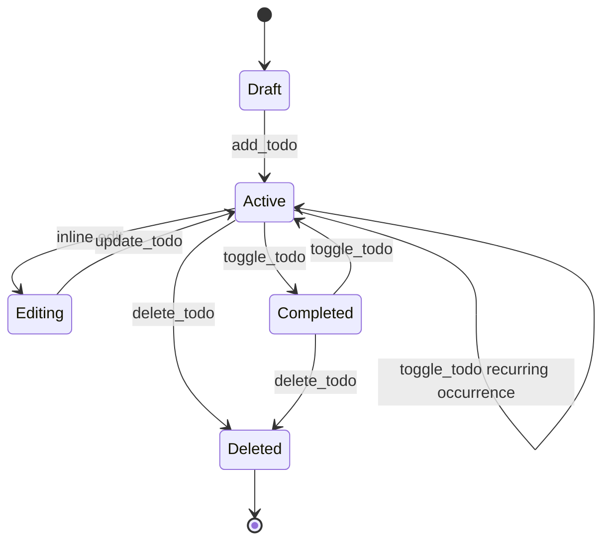
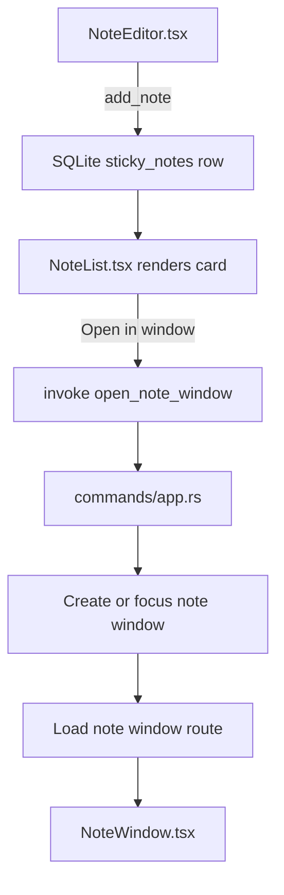
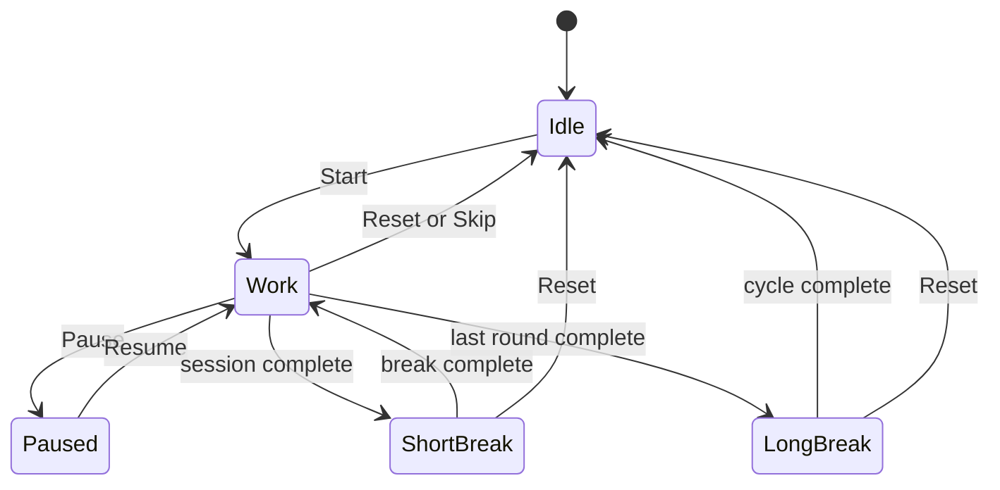
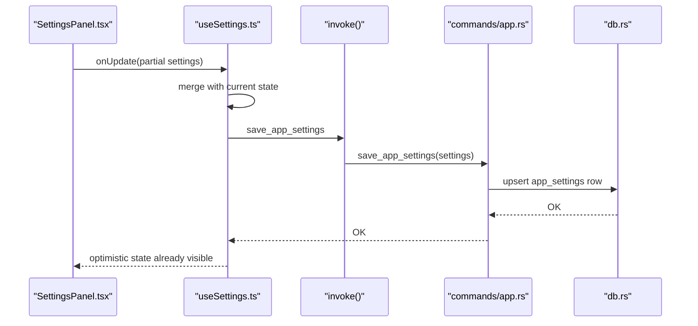
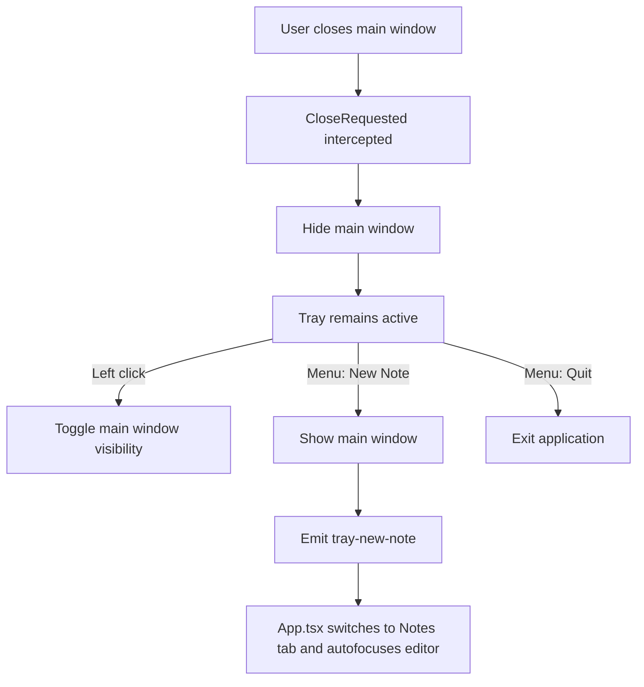
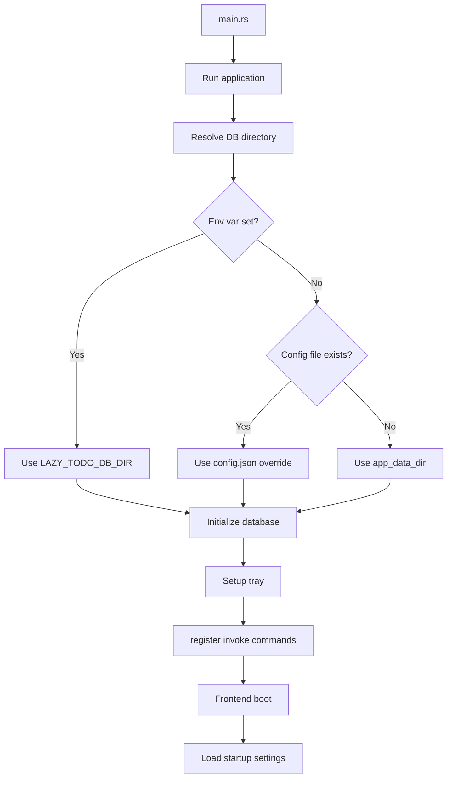

# Lazy Todo App — Workflows

<!-- maintained-by: human+ai -->

## Workflow 1: Todo Lifecycle

### Code Path

1. `AddTodo.tsx` submits to `useTodos.addTodo()`.
2. `useTodos` calls `invoke("add_todo", { input })`.
3. `commands/todo.rs` validates and forwards to `db.rs`.
4. `TodoList.tsx` renders active tasks in list or grid mode based on `settings.todo_display`.
5. `TodoItem.tsx` uses `useCountdown.ts` to show deadline status in real time.
6. Recurring todos keep `deadline` as the next visible due occurrence; completing one records `todo_occurrences` history and advances the deadline.
7. `useTodos.ts` checks due reminders while the app is running, marks delivered occurrences, and falls back to in-app reminder state if desktop notifications are unavailable.

## Workflow 2: Sticky Note Creation and Pop-Out

### Notes

- `NoteCard.tsx` can still edit inline in the main window.
- `NoteWindow.tsx` loads the note by ID using `list_notes` and persists edits through `update_note`.
- Markdown is rendered by `MarkdownPreview.tsx`.
- External links are intercepted in `src/main.tsx` and opened through `@tauri-apps/plugin-shell`.

## Workflow 3: Pomodoro Session and Milestones

### Phase Handling

- `usePomodoro.ts` keeps the timer alive even when the Pomodoro tab is hidden.
- Finishing a work phase records a session via `record_pomodoro_session`.
- `PomodoroMilestones.tsx` surfaces up to three active milestones and lets the user mark them as `completed`, `cancelled`, or restored to `active`.
- The backend stores milestone state inside `pomodoro_settings.milestones_json`.
- `update_tray_tooltip` keeps the tray hover text synchronized with the timer.

## Workflow 4: Settings Persistence

### Stored Preferences

- `page_size`
- `todo_display`
- `note_display`
- `note_template`
- `note_folder`

These settings are loaded on app startup via `get_app_settings`.

## Workflow 5: System Tray and Window Lifecycle

## Workflow 6: App Startup

---
<!-- PKB-metadata
last_updated: 2026-04-12
commit: f9ba186
updated_by: human+ai
-->
