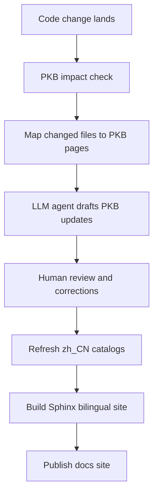

# Lazy Todo App — Generating the Project Knowledge Base

<!-- maintained-by: human+ai -->

## Purpose

This page explains how to create, update, translate, and publish the Project Knowledge Base (PKB) for `lazy-todo-app`.

In this repository, the PKB lives directly under `doc/`. English Markdown is the source of truth, the content is often drafted or updated with an LLM plus documentation skills, and the published site is built with `Sphinx + MyST + sphinx-intl + Mermaid`.

The current documentation workflow combines:

- an LLM to analyze the repo and draft PKB pages
- skills such as the Project Knowledge Base skill to enforce structure and conventions
- human review to correct intent, wording, and architectural judgment
- Sphinx tooling to build bilingual HTML output

## LLM + Skills Workflow

For this project, PKB pages are typically generated or updated through an LLM-assisted workflow rather than written fully by hand from scratch.

The practical flow is:

1. The LLM reads the repository structure, key configs, and existing docs.
2. A documentation skill such as the Project Knowledge Base skill helps structure the output into PKB pages like overview, repo map, architecture, workflows, runbook, and testing docs.
3. The generated Markdown is written into `doc/` as English source pages.
4. A human reviews and edits the result to make sure the "why", terminology, and product intent are correct.
5. The docs are translated through gettext catalogs and then built into the bilingual site with `Sphinx + MyST + sphinx-intl`.
6. Mermaid diagrams are used when workflows or architecture benefit from visual explanation.

This means the PKB should be treated as human-reviewed, AI-assisted documentation. The LLM is responsible for fast synthesis and structure; the human is responsible for validating accuracy, intent, and trade-offs.

## Advisory Auto-Update Loop

Today, this repository uses an advisory PKB update loop rather than a fully automatic doc-writing bot.

The implemented pieces are:

- `scripts/check_pkb_staleness.py` for rule-based PKB impact analysis
- `npm run pkb:check` for local advisory checks
- `/.github/workflows/pkb-check.yml` for PR and branch summaries in GitHub Actions

The current loop works like this:

1. Code, workflow, or configuration changes land in a branch or pull request.
2. The PKB checker maps changed files to likely-affected PKB pages.
3. The checker reports whether those PKB pages were updated in the same diff.
4. A human uses the summary to decide which English PKB pages should be refreshed.
5. The LLM plus documentation skills can then draft the updated English PKB content.
6. A human reviews the generated Markdown before translation and publishing.

The important design rule is that the checker is deterministic, but the actual documentation refresh still happens through the human-reviewed LLM + skills workflow.

## Future Design: Automatic PKB Update with an LLM Agent

This section describes a future design for keeping the PKB updated more automatically when code changes land. It is a design goal for future implementation, not a fully implemented workflow today.

### Design Goal

The goal is to reduce documentation drift by detecting likely doc impact as part of development and then using an LLM agent to propose or prepare PKB updates in time.

The intended properties are:

- advisory first, not merge-blocking by default
- deterministic impact detection before any LLM generation
- English Markdown remains the source of truth
- human review remains required before publishing
- Chinese catalogs and Sphinx output are refreshed after English doc changes

### Proposed Future Flow



### Proposed Components

#### 1. PKB Impact Checker

A lightweight checker should inspect changed files in a branch, pull request, or local diff and infer which PKB pages are likely stale.

Example mapping rules:

- frontend data and UI contract changes -> `04-data-and-api.md`, `07-testing.md`
- tray, window, or lifecycle changes -> `02-architecture.md`, `03-workflows.md`, `06-runbook.md`
- release, build, or workflow changes -> `08-build.md`
- documentation process changes -> `09-document.md`, `ai-guide.md`
- broad feature changes -> `00-overview.md`

This stage should be rule-based and deterministic so the repository can explain why a doc refresh was suggested.

#### 2. LLM Agent Drafting Step

After the likely-affected PKB pages are identified, an LLM agent with documentation skills should:

1. read the changed source files
2. read the related PKB pages
3. draft updates to the affected English Markdown pages
4. preserve the existing numbered PKB structure and metadata conventions

The LLM should focus on:

- mechanical updates such as file paths, workflows, commands, and dependency changes
- architectural summaries based on real code
- concise diagrams where they materially improve clarity

The LLM should not silently invent:

- product intent
- ADR-level trade-offs
- release decisions
- human rationale that is not visible from the code or changelog

#### 3. Human Review Gate

Even in the future automated flow, a human should still review:

- whether the right PKB pages were updated
- whether the LLM summary matches the actual change
- whether architecture explanations capture the real "why"
- whether Mermaid diagrams are valid and helpful

The intended model is AI-assisted update preparation, not fully autonomous publishing.

#### 4. Translation and Build Step

Once the English source is approved, the future workflow should continue with the current translation and build pipeline:

```bash
cd doc
poetry run make gettext
poetry run make intl-update
poetry run make html
```

That keeps the existing repo rule unchanged:

- English Markdown in `doc/` is the source of truth
- Chinese pages are derived from `.po` catalogs
- Sphinx publishes the bilingual site

### Suggested Future Trigger Points

The future automation could run in three places:

1. On pull requests, as an advisory PKB freshness check
2. Before release tagging, as part of the release checklist
3. Locally, through a convenience command that suggests which PKB pages to refresh

Recommended first step:

- start with advisory warnings and generated suggestions
- do not auto-commit docs changes initially
- only consider automated PR creation after the mapping and review flow prove reliable

### Non-Goals for the First Version

The first implementation should avoid:

- directly pushing generated docs to `main`
- modifying Chinese translations without human review
- blocking normal development on doc freshness
- calling a live LLM directly inside core release gating

### Why This Design Fits This Repo

This repository already has:

- numbered PKB pages under `doc/`
- metadata footers for freshness tracking
- a bilingual Sphinx build pipeline
- an LLM + skills authoring pattern already described in this page

That makes it a good fit for an incremental future design where code changes trigger PKB suggestions early, but human-reviewed Markdown remains the final published source.

## What the PKB Includes

The current PKB is organized as:

- `index.md` as the Sphinx root and docs navigation
- `00-overview.md` to `09-document.md` as the core project docs
- `ai-guide.md` as the AI onboarding guide
- `adr/` for architecture decisions
- `changes/` for structured change proposals
- `locale/zh_CN/LC_MESSAGES/` for Chinese translation catalogs
- `_templates/` and `_static/` for Sphinx theme overrides and custom styling

## Source of Truth

Follow these rules when editing project docs:

1. Write or update the English Markdown file first in `doc/`.
2. Treat the English Markdown as the authoritative source.
3. Regenerate or update the Chinese gettext catalogs only after the English source is correct.
4. Rebuild the Sphinx site after documentation changes.

This means you should edit:

- `doc/*.md` for English source pages
- `doc/index.md` when navigation changes
- `doc/locale/zh_CN/LC_MESSAGES/*.po` for Chinese translations

Even if a page was generated by an LLM or a skill, the checked-in Markdown files remain the canonical project docs after review.

## Create a New PKB Page

Use this workflow when adding a new documentation page such as `09-document.md`.

### Step 1: Create the English Source File

Create a new Markdown page in `doc/`.

Recommended conventions:

- Use a title in the form `Lazy Todo App — Topic Name`
- Add `<!-- maintained-by: human+ai -->` near the top
- End the file with a `<!-- PKB-metadata -->` footer
- Keep code references real and verified
- Prefer Mermaid diagrams only when they clarify structure or workflow
- Mention the relevant build or generation stack when it matters, such as `Sphinx`, `MyST`, `sphinx-intl`, and `Mermaid`

### Step 2: Add the Page to the Docs Navigation

Update `doc/index.md` and add the new page to the Sphinx `toctree`.

Example:

````md
```{toctree}
:maxdepth: 2
:caption: Core Docs

00-overview
01-repo-map
...
09-document
```
````

Without this step, the page may exist on disk but will not appear in the docs navigation.

### Step 3: Add PKB Metadata

Each page should end with:

```md
---
<!-- PKB-metadata
last_updated: 2026-04-12
commit: a34edf3
updated_by: human+ai
-->
```

Field meanings:

- `last_updated`: the date of the meaningful doc update
- `commit`: the current short git commit from `git rev-parse --short HEAD`
- `updated_by`: usually `human+ai` in this repo

## Update an Existing PKB Page

When changing an existing page:

1. Edit the English Markdown source first.
2. Check whether the change affects navigation, file references, commands, workflows, or diagrams.
3. Update the PKB metadata footer.
4. Refresh translations if the English wording changed.
5. Rebuild the docs locally.

Typical changes that require translation refresh:

- new sections or renamed headings
- changed explanatory paragraphs
- updated command examples
- changed workflow descriptions

## Refresh Chinese Translations

After changing English source pages, refresh the gettext catalogs:

```bash
cd doc
poetry run make gettext
poetry run make intl-update
```

Then review the affected `.po` files in:

```text
doc/locale/zh_CN/LC_MESSAGES/
```

Typical examples:

- `index.po` when navigation changes
- `08-build.po` when the build guide changes
- `09-document.po` when this page changes

Look for:

- new untranslated `msgid` entries
- `#, fuzzy` markers
- wording drift between English source and Chinese translation

After updating translations, rebuild the site:

```bash
cd doc
poetry run make html
```

If you only changed Chinese `.po` files and did not change the English Markdown source, you usually do not need to rerun `make gettext` and `make intl-update`.

## Build and Preview the PKB

### Local HTML Build

```bash
cd doc
poetry install
poetry run make html
```

Output directories:

- English: `doc/_build/en/html/`
- Chinese: `doc/_build/zh_CN/html/`

### Local Preview Server

```bash
cd doc
poetry run make serve
```

### GitHub Pages Staging Build

```bash
cd doc
poetry run make pages
```

This prepares `doc/_build/site/` for GitHub Pages deployment.

## Suggested Authoring Checklist

Before considering a PKB update complete, verify:

1. The English Markdown source is correct and readable.
2. The page is included in `doc/index.md` if it should appear in navigation.
3. File references and commands still match the repository.
4. Mermaid diagrams use parser-safe labels.
5. LLM-generated content has been reviewed by a human for wording, intent, and technical accuracy.
6. The PKB metadata footer is updated.
7. Chinese translation catalogs are refreshed when English text changed.
8. `poetry run make html` succeeds locally.
9. Future automation designs are documented as advisory or planned behavior unless they are already implemented.

## Common Mistakes

| Mistake | Result | Fix |
|---------|--------|-----|
| Add a new page but forget `index.md` | Page is not visible in docs navigation | Add it to the `toctree` |
| Edit only Chinese `.po` files while English source is outdated | Translation drifts from the real source | Update English Markdown first |
| Forget the PKB metadata footer | Doc freshness becomes hard to track | Add or refresh the footer |
| Put fragile text in Mermaid node labels | Mermaid build or render errors | Use quoted, parser-safe labels |
| Skip `intl-update` after changing English docs | Chinese site misses new strings | Run `make gettext` and `make intl-update` |
| Trust LLM output without review | Docs may be fluent but semantically wrong | Review commands, file paths, architecture claims, and release steps before publishing |
| Present a future automation idea as if it already exists | Readers assume the repo already enforces it | Mark design sections clearly as future or planned behavior |

## Related Pages

- `08-build.md` for build, release, and publish pipelines
- `06-runbook.md` for local setup, debugging, and verification commands
- `ai-guide.md` for AI-facing maintenance rules

---
<!-- PKB-metadata
last_updated: 2026-04-12
commit: a34edf3
updated_by: human+ai
-->
